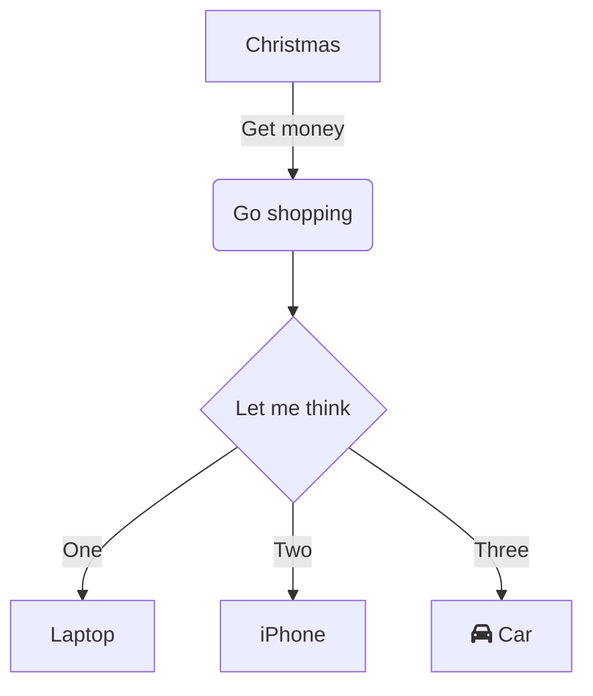
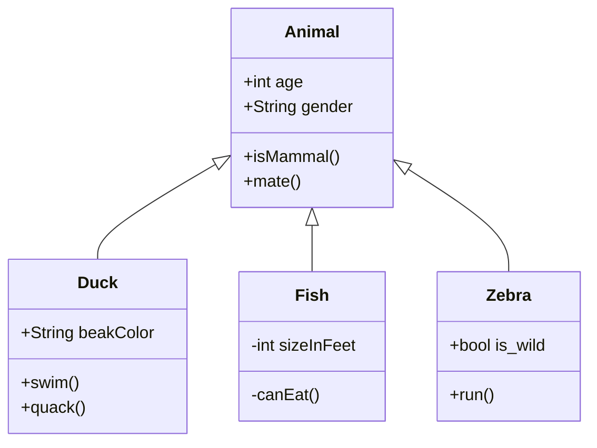
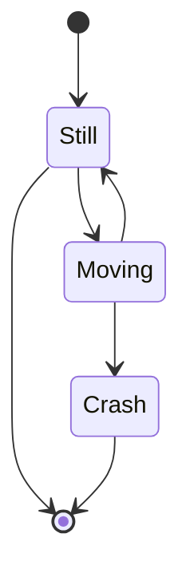
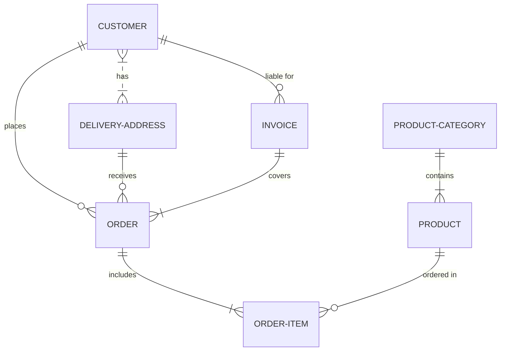

---
{"dg-publish":true,"permalink":"/resources/mermaid-diagrams/","dgHomeLink":true,"dgPassFrontmatter":false,"dgShowBacklinks":true,"dgShowLocalGraph":true,"dgShowInlineTitle":true}
---

* Mermaid Homepage https://mermaid-js.github.io/mermaid/#/
* Mermaid live editor https://mermaid.live/
* Mermaid support in Bitbucket .md files https://jira.atlassian.com/browse/BCLOUD-21675
* Mermaid supported in `.mmd` files in Bitbucket
* GitHub support for mermaid
	* https://docs.github.com/en/get-started/writing-on-github/working-with-advanced-formatting/creating-diagrams
	* https://github.blog/2022-02-14-include-diagrams-markdown-files-mermaid/
* List of places mermaid is integrated https://github.com/mermaid-js/mermaid/blob/develop/docs/integrations.md

# Examples
## Flow Chart

## Class Diagram

## State Diagram

## ER Diagram

# Alternatives 
* [[Resources/Asciiflow|Asciiflow]]